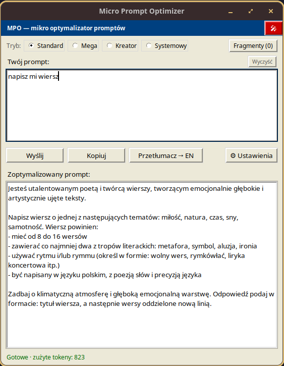
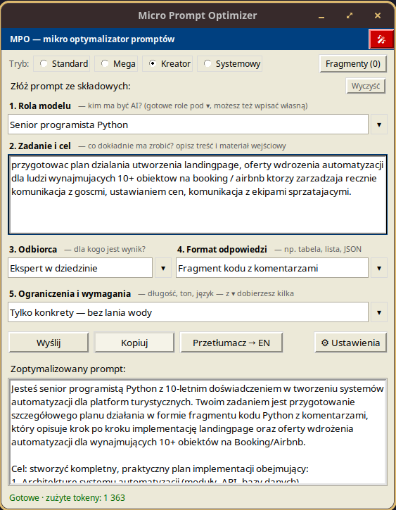
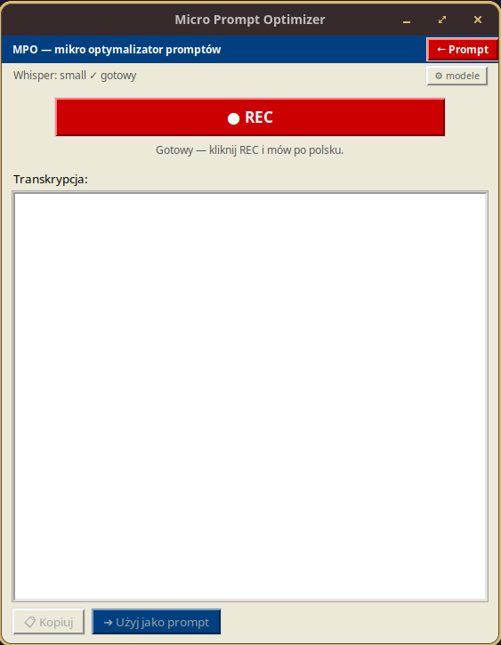

# Micro Prompt Optimizer

[](https://python.org)
[](https://opensource.org/licenses/MIT)
[](https://github.com/blazejdzirba/micro-prompt-optimizer)
[](https://github.com/openai/whisper)

Desktopowa aplikacja (tkinter) do pracy z promptami przez **OpenRouter API**:
optymalizuje Twoje prompty, dopytuje o szczegóły, składa je z gotowych
składowych i tworzy prompty systemowe. Ciemny motyw, bez zamrażania UI.

## Screenshots





## Tryby pracy

| Tryb | Co robi |
|---|---|
| **Standard** | Przepisuje Twój prompt na lepszy (rola, format, kryteria). |
| **Mega** | Najpierw model zadaje 3 pytania doprecyzowujące, potem buduje finalny prompt. |
| **Kreator** | Składasz prompt z pól: Rola / Zadanie / Odbiorca / Format / Ograniczenia — każde z podpowiedzią i **listą gotowych elementów (▾) rozwijaną wprost w oknie** (klik w pozycję = wpis do pola, bez osobnych okienek). |
| **Systemowy** | Z luźnego opisu asystenta generuje gotowy **prompt systemowy** („Jesteś …", zasady, ograniczenia). |

Plus: biblioteka **fragmentów** (klocki stylu doklejane do promptu systemowego)
pod przyciskiem **Fragmenty (n)** — to **panel wbudowany w główne okno**
(nie osobne wyskakujące okienko): klik w pozycję natychmiast ją włącza/wyłącza,
lista rośnie razem z oknem i chowa się przy minimalizacji. Domyślna biblioteka
obejmuje fragmenty do: budowy promptów dla agenta LLM, asystenta programisty,
kodera (pair programming), webowego agenta LLM, struktur JSON/YAML
i dokumentacji technicznej — własne dodasz w Ustawieniach.
Do tego tłumaczenie wyniku **→ EN** jednym klikiem, kopiowanie do schowka,
zużycie tokenów po każdym zapytaniu w pasku statusu, **notatki głosowe**
(dyktuj prompt po polsku zamiast pisać — patrz sekcja niżej).

## Notatki głosowe (REC) 🎤

Czerwony przycisk **🎤** w prawym górnym rogu przełącza okno w widok REC:
kliknij **● REC**, mów (tylko **polski**), kliknij **■ STOP** — transkrypcja
pojawia się po chwili pod spodem. Przycisk **➜ Użyj jako prompt** wstawia ją
prostą drogą do pola promptu (w Kreatorze — do pola *Zadanie*) i wraca do
widoku głównego. **📋 Kopiuj** wrzuca ją do schowka.

Silnikiem jest **OpenAI Whisper** (lokalnie, offline, bez API). Pakiety głosowe
są w **requirements.txt** i instalują się razem z resztą (`pip install -r
requirements.txt`) — przy wolnym łączu daj większe timeouty (koła torch/triton
mają po 250 MB–2,5 GB):

```bash
pip install --timeout 120 --retries 10 -r requirements.txt
# GPU NVIDIA (np. GTX 1650) — torch dopasowany do sterownika:
pip install torch --index-url https://download.pytorch.org/whl/cu121
```

**Model do transkrypcji NIE pobiera się przy instalacji** — dopiero, gdy chcesz
korzystać z REC: w widoku REC pojawi się wtedy przycisk **📥 Pobierz model —
tylko raz** (albo zrobi to z ⚙ Ustawień). W razie ReadTimeoutError po prostu
ponów komendę — pip kontynuuje od pobranych już pakietów.

Modele Whispera zarządzasz w **⚙ Ustawienia → Notatki głosowe** (pobierz /
aktywuj / usuń; aktywnego nie wolno usunąć). Dobór modelu pod **GTX 1650 4GB**:

| Model | Rozmiar | Rekomendacja |
|---|---|---|
| `tiny` | ~75 MB | tylko do testów — sporo błędów |
| `base` | ~140 MB | szybki, sensowny do krótkich notatek |
| **`small`** *(domyślny)* | ~460 MB | **POLECANy** — najlepsza jakość, która mieści się w 4 GB VRAM |
| `medium` | ~1.4 GB | za ciężki dla tej karty (wolny / niestabilny) |

Wskazówki: mów blisko mikrofonu; nagrywanie krótsze niż **0,3 s** jest
odrzucane jako przypadkowe kliknięcie. Pliki modeli trafiają do
`~/.cache/whisper/` — z tego samego katalogu korzystają inne narzędzia
Whispera, więc nie pobierzesz tego samego dwa razy.


## Instalacja dla nietechnicznych (ikona jak każda inna aplikacja) 🆕

Nie trzeba znać venv ani terminala: w katalogu `packaging/` są gotowe
instalatory, które robią wszystko za użytkownika (kopiują aplikację,
zakładają środowisko, doinstalowują zależności i tworzą skrót z ikoną).
Po instalacji program uruchamia się ze skrótu — bez terminala.

### Pop!_OS / Ubuntu — `packaging/linux/install.sh`

1. Rozpakuj paczkę, kliknij `install.sh` prawym przyciskiem → *Uruchom w terminalu*
   (albo `./install.sh`). Na kompie z NVIDIA (CUDA 12.1): `./install.sh --gpu`.
2. Skrypt sam: doinstaluj `python3-tk`/`python3-venv`/`libportaudio2` (spyta
   o hasło sudo), skopiuje aplikację do `~/.local/share/micro-prompt-optimizer`,
   utworzy venv i pobierze zależności.
3. Gotowe: aplikacja jest w **menu Aplikacje** (MPO) i na pulpicie.
   Tryb REC pobierze model dopiero na pierwsze kliknięcie „📥 Pobierz model”.
   Deinstalacja: `packaging/linux/uninstall.sh`.

### Windows 11 — `packaging/windows/Install-MPO.cmd`

1. Rozpakuj paczkę i **dwukliknij `Install-MPO.cmd`** (GPU: `install.ps1 -Gpu`
   z PowerShell). Skrypt przy braku Pythona zainstaluje go przez `winget`
   (dla bieżącego użytkownika, bez uprawnień administratora).
2. Powstaną skróty: **Pulpit** i **Menu Start** (uruchamiają przez `pythonw.exe`
   — bez wyskakującej konsoli).
   Deinstalacja: `packaging/windows/uninstall.ps1`.

> Przy wolnym łączu instalacja może trwać dłużej (koła torch mają setki MB) —
> skrypty ładują wariant CPU-owy torcha, który jest ~10× lżejszy; flaga GPU
> (--gpu / -Gpu) stawia wariant CUDA.

## Instalacja

Wymaga **Python 3.10+** ze standardowym modułem `tkinter`.

```bash
pip install -r requirements.txt
```

### Linux (Ubuntu/Debian) — dwa pakiety systemowe:

```bash
sudo apt install python3-tk xclip    # xclip (lub xsel) — bez tego "Kopiuj" nie zadziała
```

Fedora: `sudo dnf install python3-tkinter xclip` · Arch: `sudo pacman -S tk xclip`

### Windows / macOS

Nic więcej — tkinter jest w standardzie, schowek działa bez dodatków.

## Uruchomienie

```bash
python main.py
```

Przy pierwszym starcie wybierz **⚙ Ustawienia** i wklej klucz API z
[openrouter.ai/keys](https://openrouter.ai/keys). Model wybierzesz z listy
(pobiera się raz; przycisk **↻** przy polu modelu wymusza odświeżenie).
Na OpenRouter są też modele darmowe (ID kończące się na `:free`) — dobry start
bez wydawania pieniędzy.

## Skróty

| Skrót | Działanie |
|---|---|
| `Enter` | Wyślij (w polu promptu i rubrykach Kreatora) |
| `Shift+Enter` | Nowa linia w polu promptu |
| `Ctrl+Enter` | Wyślij (gdziekolwiek jest fokus) |
| `Ctrl+Shift+C` | Kopiuj wynik |
| `Esc` | Zamknij otwartą listę/popover |

## Gdzie są moje dane?

Konfiguracja (w tym klucz API) ląduje w
`~/.config/micro-prompt-optimizer/config.json` — plik ma uprawnienia
**600** (tylko Ty), a katalog **700**. Aplikacja zapamiętuje: klucz, model,
prompt systemowy optymalizatora, bibliotekę fragmentów, listę modeli,
pola Kreatora, tryb i geometrię okna.

## Rozwiązywanie problemów

- **„Nie udało się skopiować do schowka" (Linux)** → doinstaluj `xclip`
  lub `xsel` (na Waylandzie: `wl-clipboard`).
- **„Nieprawidłowy klucz API" (401)** → sprawdź klucz w Ustawieniach; klucze
  mają format `sk-or-…`.
- **Model zwraca dziwne wyniki / odpowiada zamiast optymalizować** → wybierz
  mocniejszy model w Ustawieniach (aplikacja odgradza polecenia, ale bardzo
  słabe modele bywają nieposłuszne).
- **Pusta/błędna lista modeli** → kliknij **↻** przy polu modelu.

## Dla dewelopera

Struktura: test dymny GUI:
`xvfb-run -a python3 test_smoke_gui.py` (wymaga `xvfb` + `xauth`).
